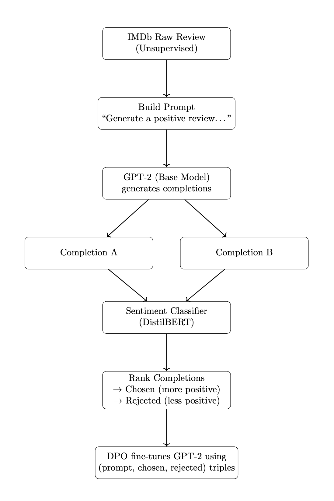
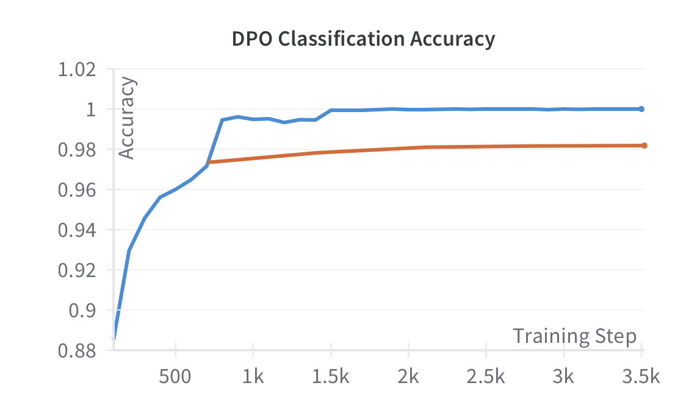
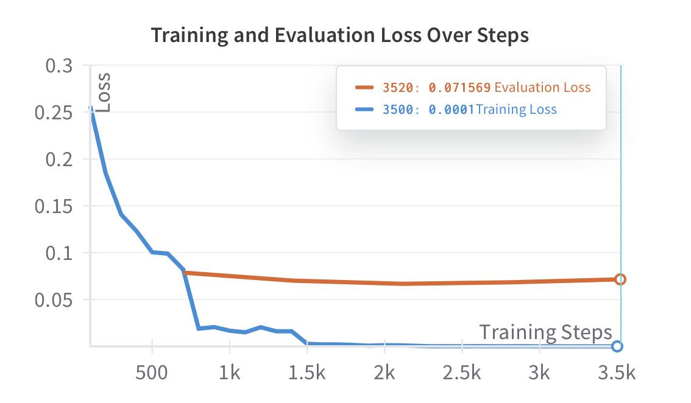
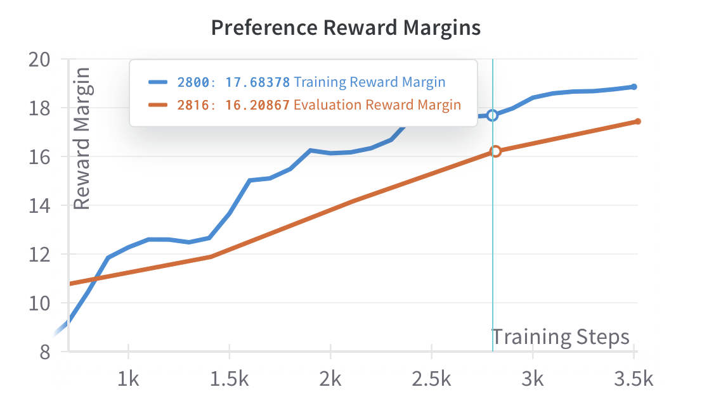

# Sentiment-Guided GPT-2 Fine-Tuning via Direct Preference Optimization (DPO)

This project fine-tunes a GPT-2 language model to generate positive movie reviews from raw IMDb data using Direct Preference Optimization (DPO). It leverages a sentiment classifier (DistilBERT) to construct preference triplets without human labels or explicit reward modeling. After fine-tuning, the model successfully learned to generate fluent and positive reviews.

## Overview

We use IMDb raw reviews as unsupervised prompts to guide generation and preference learning:
1. Generate completions using a base GPT-2 model.
2. Rank completions with a DistilBERT sentiment classifier.
3. Form (prompt, chosen, rejected) triplets.
4. Fine-tune GPT-2 using the DPO loss.


<div align="center">
  
</div>


## DPO Loss Function

The DPO loss encourages the model to prefer completions with higher implicit reward:
```math
\mathcal{L}_{\text{DPO}} = -\log \left( \frac{\exp(\beta \log \pi_\theta(y^+ \mid x))}{\exp(\beta \log \pi_\theta(y^+ \mid x)) + \exp(\beta \log \pi_\theta(y^- \mid x))} \right)
```
Where:
- y⁺ = preferred response
- y⁻ = rejected response
- πₜₕₑₜₐ = model policy
- β = temperature-like hyperparameter


## Training Environment

- Hardware accelerator: NVIDIA A100 PCIe GPU
- Model & dataset loading: Hugging Face Transformers and Datasets libraries
- Frameworks used: PyTorch, Hugging Face trl, wandb, scikit-learn


## Visualizations

Training metrics like loss, preference margins, and accuracy are tracked using Weights & Biases (W&B).

### 1. DPO Classification Accuracy

This plot shows how accurately the fine-tuned model identifies the preferred response (`y⁺`) over the rejected one (`y⁻`). The training accuracy quickly approaches 100%, while the evaluation accuracy steadily improves, indicating strong preference learning.

<div align="center">
  
</div>

---

### 2. Training and Evaluation Loss

This plot tracks the DPO loss across training steps. The training loss rapidly decreases and stabilizes near zero, while the evaluation loss declines more gradually.

<div align="center">
  
</div>

---

### 3. Preference Reward Margins

Reward margins reflect the model’s confidence in selecting the better response. Both training and evaluation margins increase over time, suggesting the model is learning a stronger signal for positive sentiment generation.

<div align="center">
  
</div>
